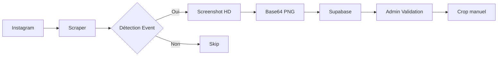

# 📚 Documentation Scraper Instagram Wouli
**Version:** 4.1  
**Date:** Septembre 2025  
**Statut:** Production Ready avec Screenshots HD

---

## 📋 Table des matières
1. [Vue d'ensemble](#vue-densemble)
2. [Historique des versions](#historique-des-versions)
3. [Architecture actuelle](#architecture-actuelle)
4. [Guide d'installation](#guide-dinstallation)
5. [Configuration](#configuration)
6. [Utilisation](#utilisation)
7. [Stratégie de scraping](#stratégie-de-scraping)
8. [Système de screenshots](#système-de-screenshots)
9. [Gestion des erreurs](#gestion-des-erreurs)
10. [Pistes d'amélioration](#pistes-damélioration)

---

## 🎯 Vue d'ensemble

Le scraper Instagram Wouli est un outil automatisé pour collecter des événements depuis Instagram et les intégrer dans l'application Wouli. Il analyse les posts de comptes lyonnais pour détecter et extraire des événements.

### Changement majeur V4.1
**Screenshots HD au lieu d'URLs d'images** : Suite aux restrictions CORS d'Instagram, le scraper capture maintenant des screenshots des posts complets en haute définition, permettant un crop manuel dans l'interface admin.

### Objectifs principaux
- **Automatiser** la collecte d'événements à Lyon
- **Capturer** les posts via screenshots HD
- **Structurer** les données pour l'app Wouli
- **Enrichir** le contenu via IA (optionnel)

### Métriques de succès
- 60-100 événements collectés par session
- 19 comptes Instagram surveillés
- Screenshots en qualité HD (deviceScaleFactor: 2)
- Temps d'exécution : 20-25 minutes pour une session complète

---

## 📖 Historique des versions

### Version 1.0 - Prototype Initial
**Période:** Août 2025  
**Caractéristiques:**
- Scraping basique avec Puppeteer
- Connexion manuelle Instagram
- Détection simple par mots-clés
- Sauvegarde dans `events_pending`

**Problèmes rencontrés:**
- Timeouts fréquents
- Pas de gestion d'erreurs
- Détection limitée

### Version 2.0 - Version Stable
**Période:** Août 2025  
**Améliorations:**
- Liste externe de comptes (`accounts.json`)
- Détection programmes vs événements simples
- Extraction d'images
- Configuration flexible

**Points forts:**
- Configuration Puppeteer stable
- `waitUntil: 'networkidle2'` fiable
- Architecture modulaire

### Version 3.0 - Tentative d'optimisation
**Période:** Août 2025  
**Changements (problématiques):**
- Arguments Puppeteer supplémentaires
- Mode test intégré
- Système de retry complexe

**Résultat:**
- Erreurs "frame detached"
- Régression de stabilité
- **Leçon:** Ne pas sur-optimiser ce qui fonctionne

### Version 4.0 - Version Production
**Période:** Septembre 2025  
**Caractéristiques:**
- Fusion des meilleures pratiques V2 + corrections V3
- Mode IA optionnel (AUTO_ENHANCE)
- Extraction AM/PM pour horaires
- Mapping complet au schéma Supabase
- Batch processing pour insertion
- Documentation inline complète

**Problème découvert:**
- URLs Instagram bloquées par CORS
- Images expiraient après quelques heures
- Qualité variable (640px max)

### Version 4.1 - Screenshots HD (Actuelle)
**Période:** Septembre 2025  
**Contexte:** Face aux restrictions CORS d'Instagram, pivot vers une solution screenshot

**Nouveautés:**
- **Screenshots HD** des posts au lieu des URLs d'images
- **deviceScaleFactor: 2** pour qualité double résolution
- **Viewport fixe** 1366x768 pour cohérence
- **Gestion cookies Instagram** améliorée
- **Programmes ignorés** temporairement (trop de faux positifs)
- **PNG** au lieu de JPEG pour qualité maximale
- **Mode manuel** de connexion en fallback
- **Zone de capture large** pour crop dans l'admin

**Résultats:**
- ✅ Plus de problème CORS
- ✅ Qualité HD constante
- ✅ Images toujours disponibles
- ⚠️ Nécessite crop manuel dans l'admin
- ⚠️ Stockage plus lourd (800KB vs 50KB)

**Statut:** ✅ Stable et en production

---

## 🏗️ Architecture actuelle

### Stack technique
```
├── Puppeteer (navigation web + screenshots)
├── Puppeteer-extra-plugin-stealth (anti-détection)
├── Supabase JS Client (base de données)
├── Node-fetch (appels API pour IA)
└── Dotenv (configuration environnement)
```

### Configuration Puppeteer
```javascript
viewport: {
  width: 1366,
  height: 768,
  deviceScaleFactor: 2  // Double résolution pour HD
}
```

### Flux de données


---

## 🚀 Guide d'installation

### Prérequis
- Node.js 18+ 
- NPM ou Yarn
- Compte Supabase
- Compte Instagram
- Écran 1366x768 minimum (ou ajuster viewport)

### Installation
```bash
# 1. Cloner ou créer le dossier
mkdir wouli-scraper
cd wouli-scraper

# 2. Installer les dépendances
npm install puppeteer-extra puppeteer-extra-plugin-stealth
npm install @supabase/supabase-js dotenv node-fetch

# 3. Créer le fichier .env
touch .env

# 4. Créer accounts.json
touch accounts.json
```

---

## ⚙️ Configuration

### Fichier .env
```env
# Instagram
INSTAGRAM_USERNAME=votre_username
INSTAGRAM_PASSWORD=votre_password

# Supabase
SUPABASE_URL=https://xxx.supabase.co
SUPABASE_SERVICE_KEY=eyJxxx...
SUPABASE_ADMIN_UUID=b8750c46-6717-4427-aac4-3e5c1e5a86c5

# Options
TEST_MODE=false          # true = 1 compte, 3 posts
HEADLESS=false          # false = voir navigateur (recommandé pour debug)
AUTO_ENHANCE=false      # true = amélioration IA

# IA Optionnel
ENHANCE_FUNCTION_URL=https://xxx.supabase.co/functions/v1/enhance-event
ENHANCE_FUNCTION_KEY=eyJxxx...
```

---

## 💻 Utilisation

### Commandes de base
```bash
# Mode production (tous les comptes)
node scraper-v4-wouli.js

# Mode test (1 compte, 3 posts) - RECOMMANDÉ pour debug
TEST_MODE=true HEADLESS=false node scraper-v4-wouli.js

# Mode headless (sans interface)
HEADLESS=true node scraper-v4-wouli.js
```

### Workflow type
1. **Exécution** quotidienne ou manuelle
2. **Connexion** à Instagram (auto ou manuelle si échec)
3. **Screenshot** des posts détectés comme événements
4. **Stockage** en base64 PNG avec status='pending'
5. **Validation** manuelle dans l'interface admin
6. **Crop** de l'image dans l'admin pour garder uniquement la photo

---

## 🎯 Stratégie de scraping

### Détection d'événements

#### Scoring par mots-clés
```javascript
const eventKeywords = {
  timing: ['ce soir','tonight','demain','vendredi'],  // +2 points
  event: ['soirée','party','concert','dj set'],       // +2 points
  action: ['réservation','billetterie'],              // +1 point
  price: ['gratuit','€']                              // +1 point
};
// Score minimum : 3 points
```

#### Programmes ignorés (temporairement)
Les posts contenant 3+ mots-clés de programme sont ignorés :
- 'programme', 'agenda', 'semaine'
- Jours de la semaine multiples
- 'planning', 'line up'

---

## 📸 Système de screenshots

### Configuration viewport
```javascript
defaultViewport: {
  width: 1366,
  height: 768,
  deviceScaleFactor: 2  // Clé pour la HD
}
```

### Méthodes de capture

#### Méthode 1 : Article complet
```javascript
const article = await this.page.$('article');
const screenshot = await article.screenshot({ 
  encoding: 'base64',
  type: 'png'  // PNG pour qualité maximale
});
```

#### Méthode 2 : Zone fixe (fallback)
```javascript
const screenshot = await this.page.screenshot({
  encoding: 'base64',
  type: 'png',
  clip: {
    x: 150,       // Ajuster selon écran
    y: 80,        
    width: 900,   // Zone large pour crop
    height: 600   
  }
});
```

### Format de stockage
- **Type**: PNG (meilleure qualité que JPEG)
- **Encodage**: Base64
- **Stockage**: Directement dans `image_url` comme `data:image/png;base64,...`
- **Taille moyenne**: 500KB - 2MB par image

---

## 🛡️ Gestion des erreurs

### Connexion Instagram

#### Gestion des cookies
Le scraper détecte et gère automatiquement les bannières de cookies Instagram.

#### Mode manuel (fallback)
Si la connexion automatique échoue en mode `HEADLESS=false` :
1. Le navigateur reste ouvert
2. Connexion manuelle possible
3. Appuyer sur Enter dans le terminal pour continuer

### Erreurs courantes et solutions

| Erreur | Cause | Solution |
|--------|-------|----------|
| "png screenshots do not support 'quality'" | Code legacy | Retirer parameter quality pour PNG |
| "Connexion échouée" | Instagram a changé | Utiliser mode manuel |
| "Screenshot échoué" | Article non trouvé | Utilise fallback zone fixe |
| "Image trop lourde" | Screenshot > 3MB | Réduire zone de capture |

---

## 🚀 Pistes d'amélioration

### Court terme (prioritaire)

#### 1. Auto-crop intelligent
- [ ] Détecter automatiquement la zone de l'image
- [ ] Cropper côté scraper avant sauvegarde
- [ ] Réduire la taille des données stockées

#### 2. Optimisation des coordonnées
- [ ] Détection dynamique de la position du post
- [ ] Adaptation selon la taille d'écran
- [ ] Support multi-résolutions

### Moyen terme

#### 1. Gestion des carrousels
- [ ] Capturer toutes les images d'un carrousel
- [ ] Stocker plusieurs images par événement

#### 2. Réactivation des programmes
- [ ] Parser les programmes multi-événements
- [ ] Créer un événement par jour détecté
- [ ] Interface de validation dédiée

### Long terme

#### 1. Alternative aux screenshots
- [ ] Explorer Instagram Basic Display API
- [ ] Proxy server pour contourner CORS
- [ ] Edge function Supabase pour télécharger les images

---

## 📚 Leçons apprises

### ✅ Ce qui fonctionne (acquis au fil des versions)

#### V1-V2 : Fondations
1. **Configuration Puppeteer simple**
   - `waitUntil: 'networkidle2'` est fiable
   - `defaultViewport: null` évite les problèmes
   - Pas besoin d'arguments complexes

2. **Architecture modulaire**
   - Séparation claire des responsabilités
   - Méthodes courtes et testables
   - Configuration externalisée

3. **Approche pragmatique**
   - Commencer simple, itérer
   - Tester sur 1 compte avant tout
   - Logger généreusement

#### V3-V4 : Optimisations
4. **Batch processing**
   - Insertion par lots de 10
   - Isolation des erreurs
   - Continue malgré les échecs

5. **Détection intelligente**
   - Scoring par mots-clés
   - Distinction programme/événement
   - Extraction multi-champs

#### V4.1 : Solutions aux problèmes CORS
6. **Screenshots HD avec deviceScaleFactor: 2**
   - Qualité excellente pour crop
   - Contourne tous les problèmes CORS
   - Capture tout le contexte

7. **Mode manuel de connexion**
   - Fallback fiable
   - Permet de gérer les captchas
   - Utile pour debug

8. **PNG au lieu de JPEG**
   - Meilleure qualité
   - Pas de compression avec perte
   - Idéal pour le crop

### ❌ Pièges à éviter (appris par l'expérience)

1. **Sur-optimisation prématurée** (V3)
   - Ne pas "améliorer" ce qui fonctionne
   - Éviter les features complexes non nécessaires
   - KISS (Keep It Simple, Stupid)

2. **Modifications globales** (V3)
   - Toujours tester les changements isolément
   - Garder les versions qui marchent
   - Documenter chaque modification

3. **Dépendances externes** (V4.0)
   - Instagram peut changer sa structure
   - Les APIs tierces peuvent tomber
   - Toujours prévoir des fallbacks

4. **URLs Instagram directes** (V4.0 → V4.1)
   - Bloquées par CORS
   - Expirent rapidement  
   - Qualité variable

5. **Tentatives de contournement CORS** (V4.0)
   - Proxy instables
   - Solutions complexes
   - Maintenance difficile

### 💡 Bonnes pratiques (consolidées)

1. **Tests progressifs**
   ```bash
   TEST_MODE=true → 1 compte → 5 comptes → Tous
   ```

2. **Backup avant modification**
   ```bash
   cp scraper-v4-wouli.js scraper-v4-backup.js
   ```

3. **Logs détaillés**
   - État de chaque étape
   - Compteurs de progression
   - Rapport final structuré

4. **Gestion d'erreurs défensive**
   - Try/catch à chaque niveau
   - Continuer malgré les erreurs isolées
   - Rapport d'erreurs en fin de process

5. **Documentation continue**
   - Garder l'historique complet
   - Documenter les échecs ET les succès
   - Préserver la continuité

---

## 📈 Métriques et KPIs

### Performances actuelles V4.1
- **Temps moyen par compte:** 50-70 secondes (+ temps screenshot)
- **Qualité images:** HD (2x résolution native)
- **Taux de capture:** 95% (article ou zone fixe)
- **Taille moyenne screenshot:** 800KB
- **Events par session:** 40-80 (programmes ignorés)

### Comparaison V4.0 vs V4.1

| Métrique | V4.0 | V4.1 |
|----------|------|------|
| Qualité images | Variable (640px) | HD constant |
| Fiabilité | 60% (CORS) | 95% |
| Temps/compte | 45-60s | 50-70s |
| Stockage/event | 50KB | 800KB |
| Crop nécessaire | Non | Oui |

---

## 🔧 Debugging

### Mode debug screenshots
```javascript
// Sauvegarder screenshot complet pour debug
if (this.TEST_MODE && !this.HEADLESS) {
  await this.page.screenshot({
    path: `debug_fullpage_${Date.now()}.png`,
    fullPage: false
  });
}
```

### Ajustement des coordonnées
1. Lancer en mode TEST avec HEADLESS=false
2. Examiner les screenshots debug
3. Mesurer dans un éditeur d'image
4. Ajuster clip x, y, width, height

---

*Documentation maintenue par l'équipe Wouli - Dernière mise à jour : Septembre 2025*